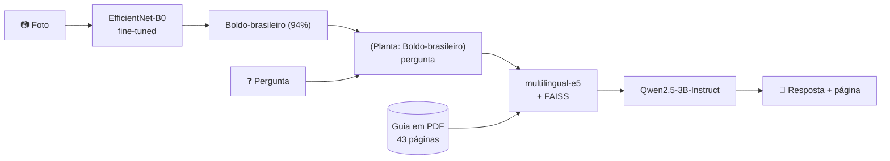

<div align="center">

# 🌿 RAG Plantas Medicinais

**Tire uma foto de uma planta e pergunte o que quiser sobre ela.**
Uma CNN reconhece a espécie e um LLM open-source responde com base em um guia de fitoterápicos, citando a página.

[](https://colab.research.google.com/github/JFcamp/rag-plantas-medicinais/blob/main/rag_plantas_medicinais_colab.ipynb)


</div>

---

## Sobre

Projeto criado para o minicurso **"Fine-tuning de CNN e RAG com LLM open-source"**, apresentado na **WSIS 2026** (UFV – Campus Rio Paranaíba).

A ideia é juntar duas coisas que normalmente aparecem separadas: **visão computacional** e **RAG**. Você manda a foto, o classificador diz qual planta é, e a partir daí dá pra perguntar *para que serve*, *como fazer o chá*, *qual a dose*, *quem não pode usar* ou *como cultivar*. O modelo responde **só** com o que está no guia e indica a página de onde tirou a informação.

Tudo roda em um único notebook no Google Colab, com GPU T4 gratuita.

## Como funciona



| Etapa | O que acontece |
|---|---|
| **1. Dataset** | Baixa ~300 fotos por planta do [iNaturalist](https://www.inaturalist.org), priorizando observações de *grau pesquisa* e só com licenças abertas (CC0, CC BY, CC BY-NC). |
| **2. Classificador** | Fine-tuning da **EfficientNet-B0** (pré-treinada no ImageNet) com data augmentation, AdamW, cosine annealing e mixed precision. |
| **3. RAG** | O PDF é quebrado em chunks de ~800 caracteres, vetorizado com **multilingual-e5-base** e indexado no **FAISS**. A busca recupera os trechos e o LLM recebe as páginas inteiras de onde eles vieram. |
| **4. Chat** | O nome da planta identificada entra na pergunta, e o **Qwen2.5-3B-Instruct** responde em streaming, citando `(pág. X)`. |

## Resultados

Dataset com **4.200 fotos** (14 classes × 300), dividido de forma estratificada:

| Treino | Validação | Teste |
|:---:|:---:|:---:|
| 2.940 (70%) | 630 (15%) | 630 (15%) |

- **Acurácia no teste: 93,7%** (melhor validação: 93,65%, na época 7)
- Já na primeira época o modelo passa de 83% na validação, efeito do pré-treino.
- As classes mais difíceis são as de folhas parecidas: **hortelã**, **manjericão** e **melissa** (F1 entre 0,84 e 0,91). Camomila, babosa, calêndula e tanchagem ficam acima de 0,97.

## As 14 plantas

| | | |
|---|---|---|
| Alecrim | Babosa | Boldo-brasileiro |
| Calêndula | Camomila | Capim-limão |
| Erva-cidreira-brasileira (lípia) | Espinheira-santa | Gengibre |
| Hortelã | Manjericão | Melissa |
| Tanchagem | Vinagreira (hibisco) | |

## Como rodar

1. Clique no botão **Open in Colab** lá em cima.
2. Vá em **Ambiente de execução → Alterar o tipo de ambiente de execução → T4 GPU**.
3. Baixe o [`guia_plantas_medicinais.pdf`](guia_plantas_medicinais.pdf) deste repositório (o notebook pede o upload na célula 10).
4. Rode as células **em ordem**. A primeira execução leva uns 15 a 20 minutos, a maior parte é o download das fotos.

No chat, use os comandos:

| Comando | Ação |
|---|---|
| `foto` | envia outra foto |
| `limpar` | esquece a planta identificada |
| `sair` | encerra o chat |

Perguntas que funcionam bem: *"para que serve?"*, *"como faço o chá?"*, *"grávida pode usar?"*, *"tem interação com remédios?"*, *"com qual planta ela é confundida?"*.

## Configuração

Os principais parâmetros ficam na célula 2 do notebook:

| Parâmetro | Padrão | Para que serve |
|---|---|---|
| `FOTOS_POR_ESPECIE` | 300 | tamanho do dataset por planta |
| `EPOCAS` | 10 | épocas de treino |
| `LIMIAR_CONFIANCA` | 0.50 | abaixo disso, o modelo avisa que não tem certeza |
| `EMBEDDER_ID` | `intfloat/multilingual-e5-base` | modelo de embeddings |
| `LLM_ID` | `Qwen/Qwen2.5-3B-Instruct` | modelo que gera a resposta |
| `TOP_K_CHUNKS` | 6 | quantos trechos a busca recupera |
| `MAX_PAGINAS` | 3 | quantas páginas inteiras vão para o LLM |

## Estrutura do repositório

```
rag-plantas-medicinais/
├── rag_plantas_medicinais_colab.ipynb              # notebook completo (dataset → treino → RAG → chat)
├── guia_plantas_medicinais.pdf                     # base de conhecimento (43 páginas)
└── Fine-tuning_de_CNN_e_RAG_com_LLM_open-source.pdf  # slides do minicurso
```

## Problemas comuns

| Situação | O que fazer |
|---|---|
| Download das fotos falhou ou ficou lento | Rode a célula 3 de novo; ela continua de onde parou. |
| `CUDA out of memory` | Reinicie a sessão e rode as células em ordem, uma vez só. |
| Confundiu melissa, hortelã e manjericão | Esperado, as folhas são parecidas. Veja o top 3 e tente uma foto mais próxima das folhas. |
| "Não encontrei essa informação" para algo que está no PDF | Aumente `TOP_K_CHUNKS` ou `MAX_PAGINAS`. |

## Aviso

> [!WARNING]
> Projeto **educativo**. A identificação por IA pode errar, e as respostas não substituem a orientação de médicos, farmacêuticos ou outros profissionais de saúde. Nunca use uma planta com base só na identificação feita pelo modelo.

## Créditos

- **Fotos:** usuários do [iNaturalist](https://www.inaturalist.org), sob licenças CC0, CC BY e CC BY-NC. O notebook gera um `creditos.csv` com autor, licença e link de cada imagem. Use o dataset apenas para fins educativos e não comerciais.
- **Conteúdo do guia:** indicações e doses baseadas no *Formulário de Fitoterápicos* da ANVISA.
- **Modelos:** [EfficientNet-B0](https://pytorch.org/vision/stable/models/efficientnet.html) (torchvision), [multilingual-e5-base](https://huggingface.co/intfloat/multilingual-e5-base) e [Qwen2.5-3B-Instruct](https://huggingface.co/Qwen/Qwen2.5-3B-Instruct).

## Autor

**Pedro Henrique Campos Moreira**
Sistemas de Informação · UFV Campus Rio Paranaíba

[](https://www.linkedin.com/in/pedro-campos-5760a92ab)
[](https://github.com/JFcamp)
